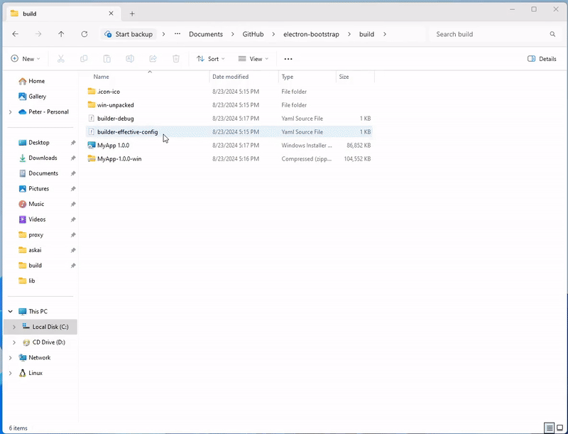

# ⚛️ Electron Bootstrap

> Web server + ElectronJS to wrap any website into the native window



## Usage

**1. Install dependencies**

```bash
npm install
```

**2. Add some HTML**

```bash
touch ./lib/index.html
nano ./lib/index.html
```

**3. Deploy**

> Windows `msi` build

```bash
npm run build:windows
```

> Linux `deb` / `appimage` build

```bash
npm run build:linux
```

**4. Run**

Double click on `*.msi` to install the app. The right click is disabled and menu bar is hidden. The static assets are shared on `http://localhost:1338`.

